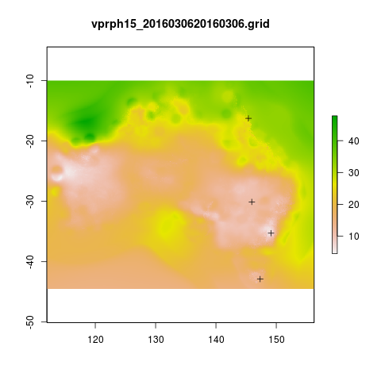

awaptools
=========

[](https://travis-ci.org/swish-climate-impact-assessment/awaptools)
[](https://ci.appveyor.com/project/swish-climate-impact-assessment/awaptools)
[](https://codecov.io/github/swish-climate-impact-assessment/awaptools?branch=master)
[](http://cran.r-project.org/package=awaptools)


- The Bureau of Meteorology has generated a range of gridded meteorological datasets for Australia as a contribution to the Australian Water Availability Project (AWAP). 
- An R package to download and format the AWAP grids.
- Binaries available from [http://swish-climate-impact-assessment.github.com/tools.html](http://swish-climate-impact-assessment.github.com/tools)
- More info is available [http://www.bom.gov.au/jsp/awap/](http://www.bom.gov.au/jsp/awap/)
- The documentation of the data creation is at [http://www.bom.gov.au/amm/docs/2009/jones.pdf](http://www.bom.gov.au/amm/docs/2009/jones.pdf)

#### R-Code: A workflow to download and process the public BoM weather grids.

```r
# This workflow uses the open source R software with some of our custom written packages:
# aim daily weather for any point location from online BoM weather grids
# depends on some github packages, either use devtools
install.packages("devtools")
library(devtools)
install_github("awaptools", "swish-climate-impact-assessment")

# OR download and install
# http://swish-climate-impact-assessment.github.io/tools/awaptools/awaptools-downloads.html


library(awaptools)
library(rgdal)
library(raster)
library(plyr)
library(reshape) 
library(ggmap)
# get weather data, beware that each grid is a couple of megabytes
vars <- c("maxave","minave","totals","vprph09","vprph15") #,"solarave") 
# solar only available after 1990
for(measure in vars)
{
  #measure <- vars[1]
  get_awap_data(start = '2016-03-04',end = '2016-03-06', measure)
}
 
# get location
address2 <- c("1 Lineaus way acton canberra", "daintree forest queensland", "hobart",
              "bourke")
locn <- geocode(address2)

# this uses google maps API, better check this
locn

## Treat data frame as spatial points
epsg <- make_EPSG()
shp <- SpatialPointsDataFrame(cbind(locn$lon,locn$lat),data.frame(address = address2, locn),
                              proj4string=CRS(epsg$prj4[epsg$code %in% '4283']))
# now loop over grids and extract met data
cfiles <-  dir(pattern="grid$")
 
for (i in seq_len(length(cfiles))) {
  #i <- 1 ## for stepping thru
  gridname <- cfiles[[i]]
  r <- raster(gridname)
  #image(r) # plot to look at
  e <- extract(r, shp, df=T)
  #str(e) ## print for debugging
  e1 <- shp
  e1@data$values <- e[,2]
  e1@data$gridname <- gridname
  # write to to target file
  write.table(e1@data,"output.csv",
    col.names = i == 1, append = i>1 , sep = ",", row.names = FALSE)
}
# further work is required to format the column with the gridname to get out the date and weather paramaters.

dat <- read.csv("output.csv", stringsAsFactors = F)
head(dat)
dat$date <- matrix(unlist(strsplit(dat$gridname, "_")), ncol = 2, byrow=TRUE)[,2]
dat$date <- paste(substr(dat$date,1,4), substr(dat$date,5,6), substr(dat$date,7,8), sep = "-")
dat$measure <- matrix(unlist(strsplit(dat$gridname, "_")), ncol = 2, byrow=TRUE)[,1]


dat <- arrange(dat[,c("address", "lon", "lat", "date", "measure", "values")], address, date, measure)
head(dat)

dat2 <- cast(dat, address +    lon     +  lat    +   date ~ measure, value = 'values',
      fun.aggregate= 'mean')
dat2

"
                        address     long       lat       date maxave minave
1  1 Lineaus way acton canberra 149.1164 -35.27676 2016-03-04  32.55  15.10
2  1 Lineaus way acton canberra 149.1164 -35.27676 2016-03-05  35.04  15.24
3  1 Lineaus way acton canberra 149.1164 -35.27676 2016-03-06  34.09  15.36
4                        bourke 145.9375 -30.09011 2016-03-04  39.01  25.97
5                        bourke 145.9375 -30.09011 2016-03-05  38.89  22.15
6                        bourke 145.9375 -30.09011 2016-03-06  38.36  21.83
7    daintree forest queensland 145.3798 -16.24014 2016-03-04  28.53  23.70
8    daintree forest queensland 145.3798 -16.24014 2016-03-05  29.09  24.51
9    daintree forest queensland 145.3798 -16.24014 2016-03-06  31.28  24.86
10                       hobart 147.3238 -42.88190 2016-03-04  24.20  12.85
11                       hobart 147.3238 -42.88190 2016-03-05  24.89  12.36
12                       hobart 147.3238 -42.88190 2016-03-06  22.88  14.22
   totals vprph09 vprph15
1     8.1   17.49   13.92
2     0.1   16.28   13.18
3     1.3   16.25    7.74
4     0.1   14.09   12.43
5     0.0   15.94   12.02
6     0.0   12.80   11.31
7    90.8   31.10   29.32
8    44.3   29.84   30.60
9    18.8   31.75   30.40
10    0.0   14.23   14.45
11    0.0   12.84   12.62
12    0.3   14.94   13.90
"

png(sprintf("%s-test.png", gridname))
plot(r)
plot(shp, add = T)
title(gridname)
dev.off()

```




```r
# most data are available since 1950
vars <- c("maxave","minave","totals","vprph09","vprph15") #,"solarave") 
# solar only available after 1990
for(measure in vars)
{
  #measure <- vars[1]
  get_awap_data(start = '1950-01-01',end = '1950-01-01', measure)
}

# rainfall since 1900
measure <- "totals"
get_awap_data(start = '1900-01-01',end = '1900-01-01', measure)

#...
"
                        address     long       lat       date maxave minave
1  1 Lineaus way acton canberra 149.1164 -35.27676 1900-01-01    NaN    NaN
2  1 Lineaus way acton canberra 149.1164 -35.27676 1949-01-01  20.95  10.10
3  1 Lineaus way acton canberra 149.1164 -35.27676 1950-01-01  23.31  14.26
4  1 Lineaus way acton canberra 149.1164 -35.27676 2016-03-04  32.55  15.10
5  1 Lineaus way acton canberra 149.1164 -35.27676 2016-03-05  35.04  15.24
6  1 Lineaus way acton canberra 149.1164 -35.27676 2016-03-06  34.09  15.36
7                        bourke 145.9375 -30.09011 1900-01-01    NaN    NaN
8                        bourke 145.9375 -30.09011 1949-01-01  31.22  13.95
9                        bourke 145.9375 -30.09011 1950-01-01  40.13  26.74
10                       bourke 145.9375 -30.09011 2016-03-04  39.01  25.97
11                       bourke 145.9375 -30.09011 2016-03-05  38.89  22.15
12                       bourke 145.9375 -30.09011 2016-03-06  38.36  21.83
13   daintree forest queensland 145.3798 -16.24014 1900-01-01    NaN    NaN
14   daintree forest queensland 145.3798 -16.24014 1949-01-01  32.30  25.32
15   daintree forest queensland 145.3798 -16.24014 1950-01-01  32.43  23.26
16   daintree forest queensland 145.3798 -16.24014 2016-03-04  28.53  23.70
17   daintree forest queensland 145.3798 -16.24014 2016-03-05  29.09  24.51
18   daintree forest queensland 145.3798 -16.24014 2016-03-06  31.28  24.86
19                       hobart 147.3238 -42.88190 1900-01-01    NaN    NaN
20                       hobart 147.3238 -42.88190 1949-01-01  14.28   8.87
21                       hobart 147.3238 -42.88190 1950-01-01  23.77   5.75
22                       hobart 147.3238 -42.88190 2016-03-04  24.20  12.85
23                       hobart 147.3238 -42.88190 2016-03-05  24.89  12.36
24                       hobart 147.3238 -42.88190 2016-03-06  22.88  14.22
   totals vprph09 vprph15
1     0.0     NaN     NaN
2    10.3     NaN     NaN
3     0.0   12.42   12.19
4     8.1   17.49   13.92
5     0.1   16.28   13.18
6     1.3   16.25    7.74
7     0.3     NaN     NaN
8     0.0     NaN     NaN
9     0.1   18.77   13.88
10    0.1   14.09   12.43
11    0.0   15.94   12.02
12    0.0   12.80   11.31
13    3.0     NaN     NaN
14    1.7     NaN     NaN
15    0.7   22.73   20.11
16   90.8   31.10   29.32
17   44.3   29.84   30.60
18   18.8   31.75   30.40
19    0.0     NaN     NaN
20    1.2     NaN     NaN
21    0.3    7.52    7.47
22    0.0   14.23   14.45
23    0.0   12.84   12.62
24    0.3   14.94   13.90
"

```
